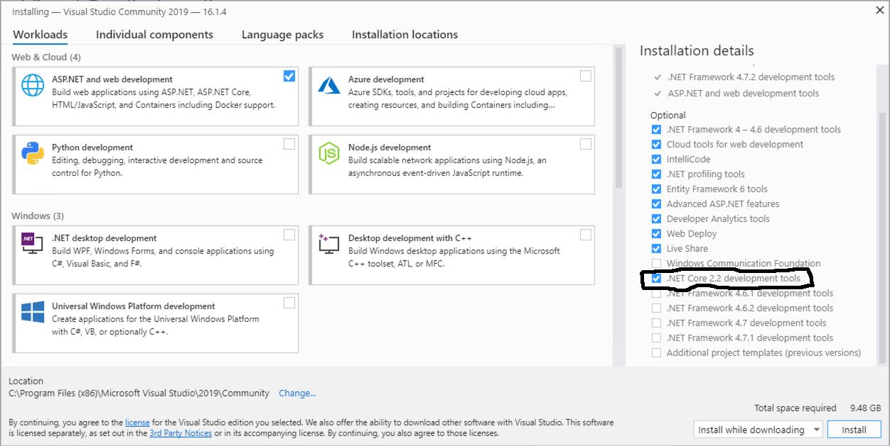

## Installing Visual Studio.NET Community Edition on Windows
Visual Studio.NET is Microsoft's Integrated Development Environment (IDE) for developing applications in C#.NET.

You can watch the [History of C#](#) while installing the tools you'll need.

Here are the resources you can use to install Visual Studio.NET on Windows
1. [Download and install Visual Studio.NET for Windows](https://visualstudio.microsoft.com/vs/features/net-development/) - make sure you select `Community Edition`
1. [Instruction from the the Microsoft's](https://docs.microsoft.com/en-us/visualstudio/install/install-visual-studio?view=vs-2019) website for installing VS.NET for Windows.
1. [Installation video](https://www.youtube.com/watch?v=X5zYiksQOF4) so you can see it in action
1. Make sure you also select `.Net Core 2.2 Development Tools`

Once you have completed installing VS.NET on your Mac you will also need to install .NET Core v.2.2 Software Development Kit (SDK) for Mac. This will install the lastest language and framework features.

Here are some resources to help with that.
1. [Download and install](https://dotnet.microsoft.com/download/dotnet-core/2.2)
1. Look for `macOS`, `.NET Core Installer: x64`